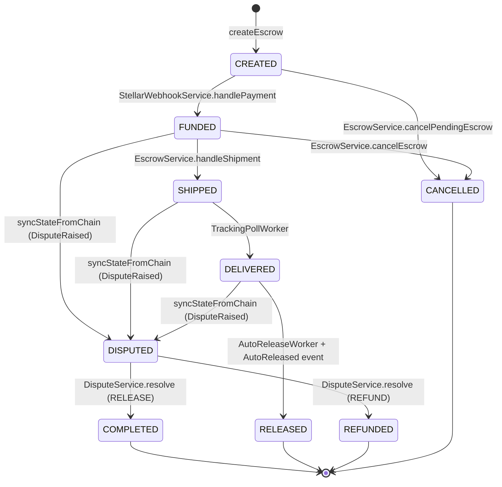

# Backend Escrow State Machine

This document is the formal lifecycle specification for the backend's `EscrowState`
enum, defined in `prisma/schema.prisma` and mirrored in
`src/common/enums/escrow-state.enum.ts`.

## Relationship to the Contract's Enum

The on-chain contract (in the separate `contracts/` repository) uses a smaller set
of states: `Pending`, `Funded`, `Shipped`, `Disputed`, `Completed`, `Refunded`,
`Canceled`. The backend extends this with three additional states to model
off-chain bookkeeping that the contract does not track:

| Backend state | Contract equivalent | Why it exists |
|---|---|---|
| `CREATED` | `Pending` | Escrow record created in the DB before funding is confirmed on-chain. |
| `DELIVERED` | _(none)_ | Carrier API reports delivery; used to start the 48-hour auto-release window. |
| `RELEASED` | _(none)_ | On-chain auto-release event confirmed; distinct from `COMPLETED` (backend-initiated release). |

Name spelling also differs: the contract uses `Canceled` (one L), the backend uses
`CANCELLED` (two L's) to match Prisma's PostgreSQL enum conventions.

## States

| State | Meaning | Terminal |
|---|---|---|
| `CREATED` | Escrow record created; buyer funds not yet locked on-chain. | No |
| `FUNDED` | Buyer funds locked in the contract (confirmed via Horizon webhook or chain sync). | No |
| `SHIPPED` | Seller marked the escrow shipped and stored a tracking ID. | No |
| `DELIVERED` | Carrier API reports delivery; 48-hour auto-release countdown begins. | No |
| `DISPUTED` | Buyer raised a dispute before the dispute deadline. | No |
| `COMPLETED` | Funds released to the seller by the backend auto-release worker or dispute resolution. | Yes |
| `RELEASED` | On-chain auto-release event confirmed (contract-initiated release). | Yes |
| `REFUNDED` | Funds returned to the buyer after dispute resolution. | Yes |
| `CANCELLED` | Escrow cancelled by buyer, seller, or admin while in `CREATED` or `FUNDED` state. | Yes |

## Diagram

## Transition Matrix

| Current state | Next state | Trigger | Code location |
|---|---|---|---|
| _(new record)_ | `CREATED` | Escrow created by vendor | `EscrowService.createEscrow` |
| `CREATED` | `FUNDED` | Buyer payment confirmed on-chain | `StellarWebhookService.handlePayment` |
| `CREATED` | `FUNDED` | Chain sync event (fallback) | `EscrowService.syncStateFromChain` (`EscrowFunded`) |
| `CREATED` | `CANCELLED` | Buyer, seller, or admin cancels | `EscrowService.cancelPendingEscrow` |
| `FUNDED` | `SHIPPED` | Seller marks shipped with tracking ID | `EscrowService.handleShipment` |
| `FUNDED` | `SHIPPED` | Chain sync event (fallback) | `EscrowService.syncStateFromChain` (`EscrowShipped`) |
| `FUNDED` | `CANCELLED` | Buyer, seller, or admin cancels | `EscrowService.cancelEscrow` |
| `FUNDED` | `DISPUTED` | Chain sync event (DisputeRaised) | `EscrowService.syncStateFromChain` (`DisputeRaised`) |
| `SHIPPED` | `DELIVERED` | Carrier API reports delivery | `TrackingPollWorker.run` |
| `DELIVERED` | `RELEASED` | Auto-release after 48h: worker submits, `AutoReleased` event finalises | `AutoReleaseWorker.run` + `EscrowService.syncStateFromChain` (`AutoReleased`) |
| `SHIPPED` | `DISPUTED` | Chain sync event (DisputeRaised) | `EscrowService.syncStateFromChain` (`DisputeRaised`) |
| `DELIVERED` | `DISPUTED` | Chain sync event (DisputeRaised) | `EscrowService.syncStateFromChain` (`DisputeRaised`) |
| `DISPUTED` | `COMPLETED` | Admin resolves with RELEASE | `DisputeService.resolve` |
| `DISPUTED` | `REFUNDED` | Admin resolves with REFUND | `DisputeService.resolve` |
| `DISPUTED` | `COMPLETED` | Chain sync event (DisputeResolved) | `EscrowService.syncStateFromChain` (`DisputeResolved`) |
| any non-terminal | `FUNDED` | Chain sync event (EscrowFunded) | `EscrowService.syncStateFromChain` (`EscrowFunded`) |
| any non-terminal | `SHIPPED` | Chain sync event (EscrowShipped) | `EscrowService.syncStateFromChain` (`EscrowShipped`) |
| any non-terminal | `COMPLETED` | Chain sync event (EscrowCompleted) | `EscrowService.syncStateFromChain` (`EscrowCompleted`) |
| any non-terminal | `DISPUTED` | Chain sync event (DisputeRaised) | `EscrowService.syncStateFromChain` (`DisputeRaised`) |
| any non-terminal | `RELEASED` | Chain sync event (AutoReleased) | `EscrowService.syncStateFromChain` (`AutoReleased`) |

## Terminal States

`COMPLETED`, `RELEASED`, `REFUNDED`, and `CANCELLED` are terminal — no further
state transitions are permitted from any of them. This is enforced by the
`TERMINAL_STATES` set at the top of `src/escrow/escrow.service.ts`.

## Guard Conditions

### `CREATED -> FUNDED`

- The Stellar Horizon webhook receives a payment matching the escrow's amount and
  asset code, addressed to the vendor's destination account.
- Alternatively, a chain sync `EscrowFunded` event arrives for the escrow.

### `CREATED -> CANCELLED`

- Caller must be the buyer, seller, or admin.
- Escrow must be in `CREATED` state.
- If on-chain state is `FUNDED`, an on-chain refund is submitted first via
  `contractService.cancelEscrowOnChain()` before marking cancelled.

### `FUNDED -> SHIPPED`

- Caller must be the seller or admin.
- Escrow must be in `FUNDED` state.
- Must not already have a `trackingId`.
- `trackingId` is stored and `shippedAt` is set.

### `FUNDED -> CANCELLED`

- Caller must be the buyer, seller, or admin.
- Escrow must be in `FUNDED` state.
- No on-chain refund is submitted (funds are still locked in the contract).

### `SHIPPED -> DELIVERED`

- `TrackingPollWorker` polls the carrier API every 10 minutes.
- When the carrier status is `DELIVERED`, `markDelivered` sets `deliveredAt` and
  `deliveryRecordedAt`, and transitions to `DELIVERED`.
- Also calls `contractService.recordDelivery()` on-chain.

### `DELIVERED -> RELEASED` (auto-release)

- `AutoReleaseWorker` polls every 5 minutes.
- Eligibility: state is `DELIVERED`, `deliveredAt` is at least
  `AUTO_RELEASE_WINDOW_HOURS` (48) ago, no dispute exists, no auto-release
  transaction has been submitted.
- The state predicate must match what `markDelivered` writes. `markDelivered`
  is the only writer of `deliveredAt` and sets `DELIVERED` in the same update,
  so any other state paired with a non-null `deliveredAt` matches nothing and
  auto-release silently never fires (issue #395).
- Uses an atomic `updateMany` optimistic lock (`markAutoReleaseSubmitting`) to
  prevent concurrent workers from double-submitting.
- On success, calls `recordAutoReleaseSubmission`, which records the
  transaction hash and leaves the state at `DELIVERED`. Submission is not
  confirmation.
- The terminal transition belongs to the `AutoReleased` chain event, which
  `syncStateFromChain` turns into `markAutoReleased` (`RELEASED`) plus the
  completion notification.

### `DISPUTED -> COMPLETED` / `DISPUTED -> REFUNDED` (dispute resolution)

- Caller must be an admin.
- Calls `contractService.resolveDispute()` on-chain.
- Updates the dispute record to `RESOLVED`.
- RELEASE: calls `escrowRepository.markCompleted()` — funds go to seller.
- REFUND: calls `escrowRepository.markRefunded()` — funds go to buyer.

### Chain sync events (`syncStateFromChain`)

The blockchain listener forwards Soroban events to `EscrowService.syncStateFromChain`.
Each event type performs the corresponding state transition, skipping escrows already
in a terminal state or the target state:

| Event | Target state | Extra action |
|---|---|---|
| `EscrowFunded` | `FUNDED` | — |
| `EscrowShipped` | `SHIPPED` | Stores `trackingId` |
| `EscrowCompleted` | `COMPLETED` | — |
| `DisputeRaised` | `DISPUTED` | Creates a `Dispute` record |
| `DisputeResolved` | `COMPLETED` | Updates dispute status to `RESOLVED` |
| `AutoReleased` | `RELEASED` | Records on-chain `txHash` |

## Invariants

- `COMPLETED`, `RELEASED`, `REFUNDED`, and `CANCELLED` are terminal states.
  No transitions are allowed from any of them.
- Self-transitions are invalid — the code skips them silently.
- `CREATED` escrows cannot be disputed or completed.
- `CANCELLED` escrows cannot be funded later.
- A dispute must resolve to either seller release (`COMPLETED`) or buyer refund
  (`REFUNDED`).
- The backend auto-release worker and the on-chain auto-release event produce
  different terminal states: `COMPLETED` (worker) vs `RELEASED` (on-chain event).
  Both represent funds released to the seller.
